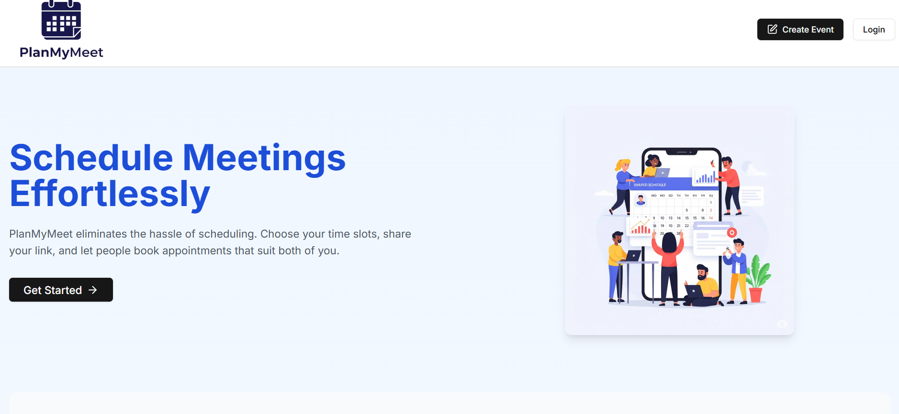

# 🗓️ PlanMyMeet – Meeting Scheduling App

Effortless and smart meeting coordination — built for professionals who value their time.

 <!-- Replace with actual image path or URL -->

## 🚀 Live Demo
[Demo](https://plan-my-meet.vercel.app) <!-- Replace with your actual deployment URL -->

---

## 📌 Overview

**PlanMyMeet** is a modern meeting scheduling platform that simplifies appointment booking with features like secure login, Google Calendar sync, time zone awareness, and smart suggestions using Gemini AI. Whether you're a freelancer, a team leader, or a remote professional — scheduling meetings has never been this seamless.

---

## 🛠️ Tech Stack

- **Frontend:** React, Next.js, Tailwind CSS  
- **Backend:** Node.js, Prisma, PostgreSQL  
- **Auth:** Clerk (Email + Google OAuth)  
- **APIs & Integrations:**  
  - Google Calendar API (with Google Meet link support)  
  - **Gemini API** – AI-based smart suggestions and automation  
- **Deployment:** Vercel  

---

## ✨ Features

✅ **Secure Authentication**  
> Sign in using Clerk with support for Google OAuth — secure, simple, and reliable.

✅ **Google Calendar Integration**  
> Sync events with Google Calendar. Automatically generate Google Meet links for every booking.

✅ **Time Zone Support**  
> PlanMyMeet auto-adjusts for your invitees’ local time zone, ensuring no mismatches.

✅ **Gemini AI Integration**  
> Use Gemini API to generate smart scheduling suggestions and automate content such as descriptions and meeting titles.

✅ **Dynamic Testimonials Carousel**  
> Real user feedback displayed in a slick, auto-playing carousel to boost trust and engagement.

✅ **Responsive UI & Clean UX**  
> Built with Tailwind CSS and accessible design practices to ensure a seamless user experience across all devices.

---

## 📸 Screenshots

<!-- Replace image paths with actual screenshots -->
| Hero Section | Features | Testimonials |
|--------------|----------|--------------|
|  |  |  |

---

## 🧠 How It Works

1. **Sign Up** – Create a free PlanMyMeet account.
2. **Set Availability** – Define time slots you're available for meetings.
3. **Share Your Link** – Send your custom booking link to clients or colleagues.
4. **Get Booked** – Your meetings are added to your Google Calendar automatically.

---

## 🧪 Running Locally

1. **Clone the repo**
```bash
git clone https://github.com/yourusername/PlanMyMeet.git
cd PlanMyMeet
````

2. **Install dependencies**

```bash
npm install
```

3. **Setup environment variables**
   Create a `.env.local` file and add:

```env
CLERK_SECRET_KEY=your_clerk_secret_key
CLERK_PUBLISHABLE_KEY=your_clerk_publishable_key
DATABASE_URL=your_postgresql_db_url
GOOGLE_CLIENT_ID=your_google_client_id
GOOGLE_CLIENT_SECRET=your_google_client_secret
NEXT_PUBLIC_CLERK_FRONTEND_API=your_clerk_frontend_api
NEXT_PUBLIC_CLERK_PUBLISHABLE_KEY=your_clerk_publishable_key
GEMINI_API_KEY=your_gemini_api_key
```

4. **Run the development server**

```bash
npm run dev
```

---

## 📅 Future Improvements

* 🛑 Rate-limiting to prevent abuse
* ✉️ Email notifications/reminders
* 📊 Admin dashboard for insights
* 🌗 Dark mode toggle
* 🧠 More AI-powered scheduling flows with Gemini


*Thanks for checking out PlanMyMeet!* 🎉
*Simplify scheduling, amplify productivity with AI.*
